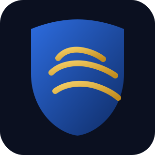

<div align="center">
  
  <h1>ClawShield</h1>
  <p>Security preflight and guardrails for OpenClaw/Moltbot</p>
</div>

## Why
- Prevent accidentally exposing the OpenClaw gateway on your LAN/WAN.
- Enforce safer defaults for group chats and non-main agents.
- Detect skill tampering via a simple lockfile.

## Install (local dev)
```bash
npm install
node ./src/cli.js --help
```

## Install (global)
```bash
npm install -g clawshield
clawshield --help
```

## Commands

### Audit your config
```bash
clawshield audit
```

### Show detected paths
```bash
clawshield paths
```

### Generate a safe profile snippet
```bash
clawshield profile safe
```

### Apply a safe profile (opt-in)
```bash
clawshield apply safe
clawshield apply safe --write --token "YOUR_TOKEN"
```

### Create or verify a skills lockfile
```bash
clawshield lock
clawshield verify
```

### Check gateway exposure
```bash
clawshield exposure
clawshield watch --interval 30
```

### macOS LaunchAgent (watch on login)
```bash
clawshield launchagent --bin /usr/local/bin/clawshield --interval 30 --write ~/Library/LaunchAgents/com.clawshield.watch.plist
launchctl load ~/Library/LaunchAgents/com.clawshield.watch.plist
```

## Notes
- Default config path: `~/.openclaw/openclaw.json` (override with `OPENCLAW_CONFIG_PATH`).
- Default workspace: `~/.openclaw/workspace`.
- `clawshield apply safe --write` creates a timestamped `.bak-*` backup and rewrites the config as JSON.

## Roadmap
- ClawdHub provenance integration (auto-verify installed skill sources).
- Optional notifications (desktop/Slack/Discord).
- Guided remediation mode.
